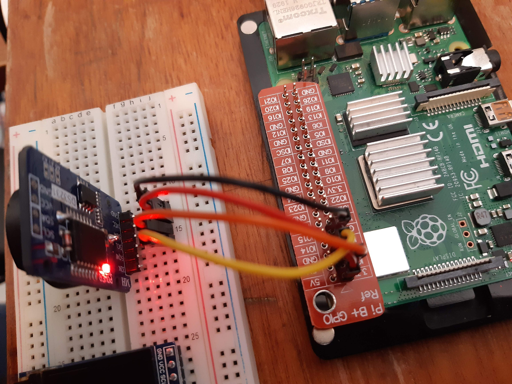

# Raspberry Pi Usage

Breadboard example of a [I2C](https://en.wikipedia.org/wiki/I2C) Real Time Clock (RTC) based on the DS3231 chip:



Enable i2c:

```bash
# NB this changes /boot/config.txt
raspi-config nonint do_i2c 0

# increase the i2c baud rate from the default of 100 KHz to 1 MHz.
# see https://github.com/raspberrypi/firmware/blob/master/boot/overlays/README
sed -i -E 's/^(dtparam=i2c_arm=on).*/\1,i2c_arm_baudrate=1000000/g' /boot/config.txt

# reboot to apply changes.
reboot

# show i2c module information.
modinfo i2c_bcm2835
modinfo i2c_dev
```

Install i2c tools:

```bash
apt-get install -y i2c-tools
```

Detect i2c buses:

```bash
i2cdetect -l
```

In my case, this displayed the single bus `i2c-1`:

```plain
i2c-1	i2c       	bcm2835 I2C adapter             	I2C adapter
```

Detect i2c devices in bus `1`:

```bash
i2cdetect -y 1
```

In my case, this displayed two devices at the addresses `0x57` and `0x68`:

```plain
     0  1  2  3  4  5  6  7  8  9  a  b  c  d  e  f
00:          -- -- -- -- -- -- -- -- -- -- -- -- --
10: -- -- -- -- -- -- -- -- -- -- -- -- -- -- -- --
20: -- -- -- -- -- -- -- -- -- -- -- -- -- -- -- --
30: -- -- -- -- -- -- -- -- -- -- -- -- -- -- -- --
40: -- -- -- -- -- -- -- -- -- -- -- -- -- -- -- --
50: -- -- -- -- -- -- -- 57 -- -- -- -- -- -- -- --
60: -- -- -- -- -- -- -- -- 68 -- -- -- -- -- -- --
70: -- -- -- -- -- -- -- --
```

At the `0x57` address is the AT24C32N EEPROM chip.

At the `0x68` address is the DS3231M RTC chip.

Install the [RTC_SDL_DS3231](https://github.com/switchdoclabs/RTC_SDL_DS3231) python library:

```bash
apt-get install -y python3-pip
python3 -m pip install smbus
wget https://raw.githubusercontent.com/switchdoclabs/RTC_SDL_DS3231/master/SDL_DS3231.py
```

Get the current time and temperature from the RTC module:

```bash
python3 <<'EOF'
import SDL_DS3231
from datetime import datetime

rtc_device = SDL_DS3231.SDL_DS3231(twi=1, addr=0x68, at24c32_addr=0x57)

# read the time.
rtc_time_utc = rtc_device.read_datetime()
print(f"time is {rtc_time_utc}")

# read the temperature.
temperature_celsius = rtc_device.getTemp()
print(f"temperature is {temperature_celsius}°")

# set the time.
#rtc_device.write_datetime(datetime(year=2020, month=1, day=1, hour=0, minute=0, second=0))
EOF
```

The next step is to use the RTC as the OS time source.

Start by disabling the fake hardware clock and network time synchronization:

```bash
apt-get remove --purge fake-hwclock
timedatectl set-ntp false
timedatectl status
```

Then reboot and verify the time is not correct anymore:

```bash
reboot
timedatectl status
date # NB on my rpi this always showed a date around 2019-02-14 10:11:59.
```

Configure the system to use the RTC as a time source:

```bash
cat >>/boot/config.txt <<'EOF'

# configure the i2c ds3231 rtc module as the linux hardware clock.
# see https://github.com/raspberrypi/linux/blob/rpi-4.9.y/arch/arm/boot/dts/overlays/i2c-rtc-overlay.dts
# NB this dtoverlay expects the DS3231M RTC chip at the 0x68 address and you cannot change it.
#    if your rtc is at another address you can probably use the i2c-rtc-gpio dtoverlay instead.
dtoverlay=i2c-rtc,ds3231
EOF
```

Then reboot and check if the linux module was correctly loaded:

```bash
reboot
dmesg | grep rtc    # you should see something alike:
                    #    [   10.398827] rtc-ds1307 1-0068: SET TIME!
                    #    [   10.399361] rtc-ds1307 1-0068: registered as rtc0
```

And check whether the i2c bus enumeration shows the `0x68` address as used:

```bash
i2cdetect -y 1
```

In my case, this displayed two devices at the addresses `0x57` and `0x68` (displayed as `UU` because its being used by the rtc linux module):

```plain
     0  1  2  3  4  5  6  7  8  9  a  b  c  d  e  f
00:          -- -- -- -- -- -- -- -- -- -- -- -- --
10: -- -- -- -- -- -- -- -- -- -- -- -- -- -- -- --
20: -- -- -- -- -- -- -- -- -- -- -- -- -- -- -- --
30: -- -- -- -- -- -- -- -- -- -- -- -- -- -- -- --
40: -- -- -- -- -- -- -- -- -- -- -- -- -- -- -- --
50: -- -- -- -- -- -- -- 57 -- -- -- -- -- -- -- --
60: -- -- -- -- -- -- -- -- UU -- -- -- -- -- -- --
70: -- -- -- -- -- -- -- --
```

Set the current system local time and write it to the RTC module, e.g.:

```bash
timedatectl status
timedatectl set-time '2020-01-17 20:54:00' # NB the format is YYYY-MM-DD HH:MM:SS
timedatectl status
```

This should display something alike:

```plain
               Local time: Fri 2020-01-17 20:54:00 GMT
           Universal time: Fri 2020-01-17 20:54:00 UTC
                 RTC time: Fri 2020-01-17 20:54:00
                Time zone: Europe/London (GMT, +0000)
System clock synchronized: no
              NTP service: inactive
          RTC in local TZ: no
```

Create an udev rule that automatically sets the system local time from the hardware clock (RTC module):

```bash
# see systemd-udevd(8)
# see udev(7)
# see /lib/udev/rules.d/85-hwclock.rules
# see /lib/udev/hwclock-set
# see udevadm info --query=all --name=/dev/rtc0
# see udevadm test $(udevadm info --query=path --name=/dev/rtc0)
cat >/etc/udev/rules.d/85-hwclock.rules <<'EOF'
# Set the System Time from the Hardware Clock.

KERNEL=="rtc0", RUN+="/sbin/hwclock --hctosys --utc --verbose"
EOF
```

Test the udev rule:

```bash
udevadm test $(udevadm info --query=path --name=/dev/rtc0)
```

It should show the expected `hwclock` command, e.g.:

```plain
DEVPATH=/devices/platform/soc/fe804000.i2c/i2c-1/1-0068/rtc/rtc0
DEVNAME=/dev/rtc0
MAJOR=253
MINOR=0
ACTION=add
SUBSYSTEM=rtc
DEVLINKS=/dev/rtc
USEC_INITIALIZED=10536541
run: '/sbin/hwclock --hctosys --utc --verbose'
```

Now reboot the system and make sure the time is correct after boot:

```bash
reboot
timedatectl status
```

This should display something alike:

**NB** Make sure the time is now after the previously set time.

```plain
               Local time: Fri 2020-01-17 20:59:00 GMT
           Universal time: Fri 2020-01-17 20:59:00 UTC
                 RTC time: Fri 2020-01-17 20:59:00
                Time zone: Europe/London (GMT, +0000)
System clock synchronized: no
              NTP service: inactive
          RTC in local TZ: no
```

Then check the system log to see if everything looks good:

```bash
systemd-analyze plot >systemd-plot.svg
journalctl -b
```
